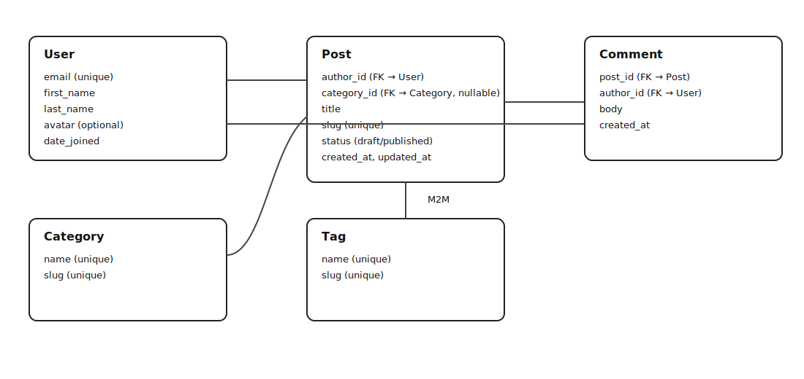

# Blog API

## ERD

## Setup (Local)

## API

Auth:
- `POST /api/auth/register/`
- `POST /api/auth/token/`
- `POST /api/auth/token/refresh/`

Posts:
- `GET /api/posts/`
- `POST /api/posts/`
- `GET /api/posts/{slug}/`
- `PATCH /api/posts/{slug}/`
- `DELETE /api/posts/{slug}/`
- `GET /api/posts/{slug}/comments/`
- `POST /api/posts/{slug}/comments/`

Comments:
- `PATCH /api/comments/{id}/`
- `DELETE /api/comments/{id}/`

## Redis Pub/Sub

Listen for new comment events:
- `python manage.py listen_comments`
